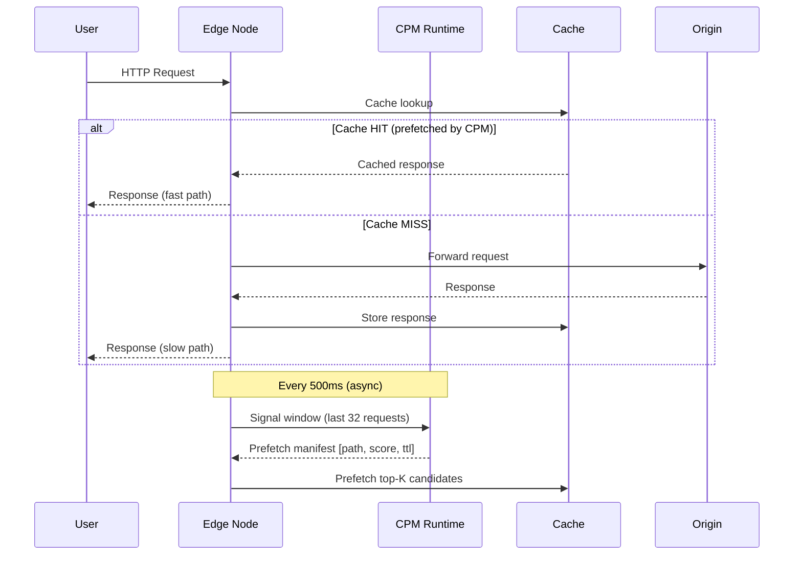

# Request Lifecycle — Data Flow

```mermaid
sequenceDiagram
    participant User
    participant EdgeNode as Edge Node
    participant CPMRuntime as CPM Runtime
    participant Cache
    participant Origin

    User->>EdgeNode: HTTP Request
    EdgeNode->>Cache: Cache lookup
    alt Cache HIT (prefetched by CPM)
        Cache-->>EdgeNode: Cached response
        EdgeNode-->>User: Response (fast path)
    else Cache MISS
        EdgeNode->>Origin: Forward request
        Origin-->>EdgeNode: Response
        EdgeNode->>Cache: Store response
        EdgeNode-->>User: Response (slow path)
    end

    Note over EdgeNode,CPMRuntime: Every 500ms (async)
    EdgeNode->>CPMRuntime: Signal window (last 32 requests)
    CPMRuntime-->>EdgeNode: Prefetch manifest [path, score, ttl]
    EdgeNode->>Cache: Prefetch top-K candidates
```